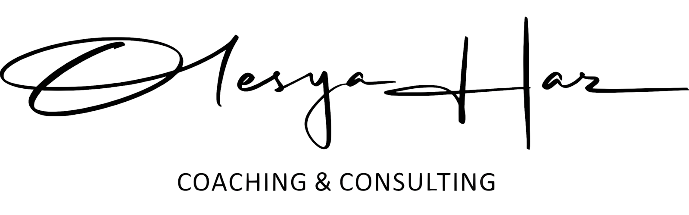

# Olesya Haz Brand Kit

This document outlines the brand identity for Olesya Haz, a counseling and therapy service.

## Brand Name

*   **Primary:** Olesya Haz
*   **Secondary (mentioned once, possibly a service or platform name):** Soluera

## Logo

The official logo is saved in this directory as `logo.png`.

## Color Palette

The following colors are used throughout the website:

| Color                 | Hex       |
| --------------------- | --------- |
| Primary                 | `#6D806B` |
| Secondary      | `#E8DCC5` |
| Accent                 | `#533D1E` |
 
## Taglines/Slogans

*   "YOU DON’T HAVE TO NAVIGATE THIS ALONE"
*   "SPEND TIME WITH SOMEONE WHO TRULY LISTENS"
*   "PARTNERS IN CREATING HEALTHIER MINDS."
*   "THE SAFE SPACE WHERE YOUR TRUTH IS HEARD"
*   "FIND THE RIGHT SUPPORT, IN THE RIGHT WAY."
*   "A SAFE SPACE TO TALK, EXPLORE, AND FEEL UNDERSTOOD"
*   "TRANSFORMATION IS A JOURNEY, AND I WILL WALK IT WITH YOU."
*   "VOICES OF THOSE WHO FOUND THEIR BALANCE."
*   "YOUR QUESTIONS, CLEARLY ANSWERED."
*   "GENTLE REMINDERS AND MENTAL HEALTH TIPS, JUST FOR YOU."

## Core Values/Keywords

*   Support (thoughtful, steady, continuous)
*   Understanding / Listening
*   Healing (holistic, grief & loss)
*   Comfort / Safety / Safe Space
*   Empathy & Compassion
*   Growth & Transformation
*   Clarity & Direction
*   Connection (with self, in relationships)
*   Professional & Trusted
*   Individual Approach
*   Easy & Flexible Access
*   Liberating / Honest / Gentle
*   Resilience / Self-awareness
*   Emotional Wellbeing / Stability

## Target Audience

Individuals experiencing:

*   Stress, emotional overwhelm, burnout
*   Relationship difficulties
*   Life stage crises / transitions
*   Childhood imprints / trauma
*   Lack of self-love & confidence
*   Grief & loss
*   Patterns of self-sabotage
*   Lack of clarity or a sense of disconnection
*   People seeking to understand emotional patterns and reconnect with inner strength.

## Services Offered

1.  Anxiety Management
2.  Life Stage Crisis
3.  Relationship Challenges
4.  Childhood Imprints
5.  Self-Love & Confidence
6.  Grief & Loss Healing

## Call to Action (CTAs)

*   "Book a Free Consultation"
*   "Discover More"
*   "Learn More"
*   "Get Started"
*   "Send a message"
*   "Fill out the contact form"

## Contact Information

*   **Phone:** +971 54 280 8118
*   **Email:** heal@olesyahaz.com
*   **Social Media:** Instagram (@olesyahaz.psy), Facebook, LinkedIn, YouTube
*   **Location (implied, but not a physical address):** "Anywhere streets No.32, Austin" (likely a placeholder or symbolic)

## Language Options

*   English
*   Russian

## Brand Personality (Inferred)

Nurturing, supportive, empathetic, understanding, professional, gentle, empowering, insightful, calm.

## Visual Cues (Implied)

The emphasis on "gentle," "calm," "safe space," and "holistic healing" suggests a brand identity that would likely use soft, calming color palettes (e.g., pastels, natural tones), clean typography, and imagery that conveys peace, introspection, and growth. The presence of social media icons (Facebook, LinkedIn, YouTube, Instagram) indicates a modern, accessible online presence.